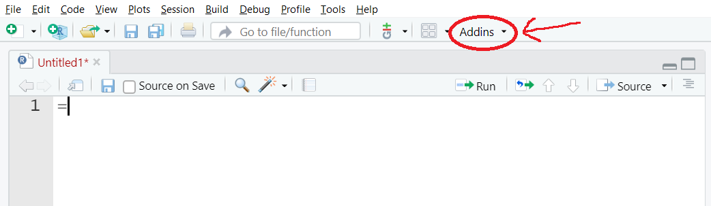
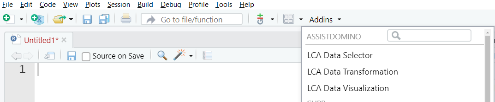

# Domino Low Code Assistant (LCA) for R

<!-- badges: start -->
[](https://github.com/dominodatalab/low-code-assistant-rstudio/actions/workflows/R-CMD-check.yaml)
<!-- badges: end -->

Accelerate routine data science tasks and smoothly interface with the Domino API through the LCA point-and-click GUI.

## Installation

### Method 1: Installing in a Domino RStudio workspace

Run the following command inside RStudio:

```r
remotes::install_github("dominodatalab/low-code-assistant-rstudio")
```

This will install *LCA for R* in your current workspace, but the tool will not persist once the workspace is stopped. 

*Note: If you encounter an error that includes "Timeout was reached", please make sure that you've selected a harware tier for your Domino Workspace that allows egress. Otherwise, your Workspace will not be able to reach GitHub to download this package.*

### Method 2: Installing in a Domino Compute environment (Recommended)

1. Click on "Environments" on the side navigation bar
2. Select the environment in which *LCA for R* should be installed
3. Click the "Edit Definition" button to allow you to make changes
4. Add the following line to the end of the Dockerfile section (but **before** the last `USER ubuntu` command):

  ```
  RUN R -e "remotes::install_github('dominodatalab/low-code-assistant-rstudio', upgrade = 'always')"
  ```

5. Click the "Build" button at the bottom of the page

This will install *LCA for R* in every workspace that uses the given Domino environment.

## How to run

In RStudio, click the "Addins" menu.



Under the heading of "ASSISTDOMINO" there will be a few buttons, one for each of the LCA modules: "LCA Data Selector", "LCA Data Transformation", "LCA Data Visualization". Click on any of the LCA modules to launch them.

> If you installed using Method 1 and you don't see the LCA menus, you may need to click on the *Session* menu and choose *Terminate R* in order for RStudio to refresh.



### Development

When developing/testing, it's useful to add `DOMINO_USER_API_KEY` and `DOMINO_API_HOST` environment variables (eg. using `.Renviron` file).
